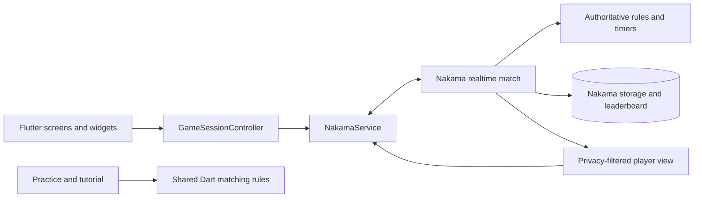

# Architecture

Sprint separates responsive client presentation from authoritative multiplayer
decisions. This keeps animations and reconnect UI smooth without allowing a
client to decide the outcome of a competitive match.

## Runtime boundaries

### Flutter client

- `screens/` compose routes and player-facing states.
- `controllers/GameSessionController` owns matchmaking, joining, authoritative
  snapshots, move submission, reconnect coordination, and navigation-safe
  lifecycle guards.
- `services/NakamaService` owns the Nakama client and realtime socket. Message
  decoding, resumable-match persistence, and feedback are split into focused
  services beside it.
- `models/` represent decoded player-visible state. Decorative feedback fields
  are allowed to fail open; authoritative core state is not inferred locally.
- `widgets/GameStatePanel` renders the arena and presentation-only animations.
  Animation completion never delays state application or move legality.

### Nakama runtime

- `contracts/` defines cards and wire payloads.
- `matches/sprint_match.ts` owns the authoritative match lifecycle and message
  dispatch.
- `game/` creates matches, validates moves, produces player views, resets stuck
  piles, and records results.
- `rpc/` provides health, private-code, profile, onboarding, and active-match
  operations.
- `matchmaking/` and `leaderboards/` contain their dedicated hooks.

## Important invariants

1. The server owns decks, hands, center piles, timers, winners, and statistics.
2. Each client receives only information that player is allowed to see.
3. Client-side matching checks improve responsiveness but never replace server
   validation.
4. Reconnect and rematch events are guarded by session generations so stale
   socket callbacks cannot restore an old match.
5. Audio, haptics, animations, and transition metadata are decorative. Their
   failure must not block play or corrupt authoritative state.
6. Practice and tutorial reuse the Dart card evaluator, while shared fixtures
   keep Dart and TypeScript legality behavior in parity.

## Match data flow

1. A player joins through quickplay, a private code, or a saved active match.
2. Nakama initializes private server state and sends each player a filtered
   `GameStateView`.
3. The client submits a move containing the selected card, target pile, and
   expected authoritative version.
4. The runtime validates ownership, version, timing, and card matching.
5. Accepted state is broadcast immediately; optional transitions drive client
   animation and sound without delaying the new snapshot.
6. Final state updates persistent profile and leaderboard statistics.

Wire-level payload details live in
[the realtime protocol](game-contract/realtime-protocol.md).
