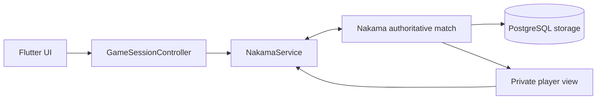

# Sprint developer guide

## 1. System overview

Sprint has two main components:

| Component | Technology | Responsibility |
| --- | --- | --- |
| Client | Flutter/Dart | UI, player input, local modes, presentation feedback, and connection coordination |
| Backend | Nakama/TypeScript/PostgreSQL | Authoritative multiplayer state, validation, timing, results, profiles, and leaderboard |

The backend is authoritative. The Flutter client may reject an obviously illegal
move for responsiveness, but it never decides competitive state or a winner.
See the [high-level architecture](architecture.md) and the
[game contract](game-contract/README.md) for deeper design details.



## 2. Requirements

- Flutter with a Dart SDK compatible with `^3.11.5`
- Docker Desktop with Docker Compose
- Node.js 22 when running backend tests outside Docker

## 3. Local setup

Start PostgreSQL and Nakama:

```powershell
cd nakama
Copy-Item .env.example .env
docker compose up -d --build
cd ..
```

Install packages and run the client:

```powershell
flutter pub get
flutter run
```

The default Nakama host is `10.0.2.2`, which reaches the development machine
from an Android emulator. Desktop and web usually use:

```powershell
flutter run --dart-define=NAKAMA_HOST=127.0.0.1
```

For a physical device, use a reachable LAN address.

## 4. Client configuration

Values in `lib/config/nakama_config.dart` can be overridden at build time:

| Dart define | Local default | Purpose |
| --- | --- | --- |
| `NAKAMA_HOST` | `10.0.2.2` | Nakama hostname without a URL scheme |
| `NAKAMA_HTTP_PORT` | `7350` | API and realtime socket port |
| `NAKAMA_GRPC_PORT` | `7349` | Nakama gRPC port |
| `NAKAMA_USE_SSL` | `false` | Enables secure client connections |
| `NAKAMA_SERVER_KEY` | `defaultkey` | Development Nakama server key |
| `GOOGLE_SERVER_CLIENT_ID` | Checked-in development ID | Google authentication client ID |

Docker ports and local database credentials can be overridden by copying
`nakama/.env.example` to `nakama/.env`. Development defaults must be replaced
before a public deployment.

## 5. Source organization

| Path | Ownership |
| --- | --- |
| `lib/screens/` | Pages and navigation composition |
| `lib/widgets/` | Reusable UI, cards, gameplay arena, and feedback overlays |
| `lib/controllers/` | Multiplayer session state and asynchronous lifecycle |
| `lib/services/` | Nakama transport, decoding, reconnect, local storage, audio, and haptics |
| `lib/models/` | Client-side data and wire models |
| `lib/gameplay/` | Shared Dart card-matching evaluator |
| `lib/practice/` | Practice match and bot behavior |
| `nakama/src/contracts/` | Cards and realtime payload types |
| `nakama/src/game/` | Authoritative setup, moves, resets, player views, and results |
| `nakama/src/matches/` | Nakama match lifecycle and opcode dispatch |
| `nakama/src/rpc/` | Health, private-match, profile, onboarding, and resume RPCs |
| `nakama/src/leaderboards/` | Wins leaderboard creation and reads |
| `test/`, `nakama/test/` | Flutter and backend regression suites |

## 6. Main runtime flows

### Multiplayer session

`GameSessionController` progresses through connecting, queueing/joining,
waiting, active, reconnecting, and finished/abandoned states. Generation guards
discard stale socket and join callbacks when a session is replaced or disposed.

### Authoritative move

1. Flutter sends the card ID, target pile, expected state version, and measured
   reaction time.
2. Nakama verifies the player, card ownership, connection state, target, and
   color/shape/count match.
3. Accepted moves update server state and increment the state version.
4. Each player receives a privacy-filtered state view.
5. Optional transitions animate the confirmed move without delaying the new
   authoritative state or legal input.

### Reconnect and resume

The client stores the current match ID locally, while Nakama stores a matching
active-match pointer. A reconnect uses an authoritative targeted snapshot; it
does not redeal cards or restart the round. Disconnect deadlines and forfeits
are decided only by Nakama.

### Persistent statistics

Completed results update both player profiles once. Normal wins can improve the
winner's best time. Forfeits update wins/losses and streaks but do not update
best time. The leaderboard score is total wins.

## 7. Verification

Format and verify Flutter:

```powershell
dart format lib test
flutter analyze --no-pub
flutter test
```

Compile and test the backend:

```powershell
cd nakama
npm test
```

`npm test` includes TypeScript compilation. After backend changes, rebuild the
runtime and inspect its health:

```powershell
docker compose up -d --build nakama
docker compose ps
docker compose logs --since 2m nakama
```

Gameplay changes should be checked with two independent clients, including
quick match, private match, concurrent moves, reconnect, rematch, and profile
updates.

## 8. Related documents

- [Architecture](architecture.md)
- [Backend setup](../nakama/README.md)
- [Card catalog](game-contract/card-catalog.md)
- [Match setup](game-contract/setup-contract.md)
- [Realtime protocol](game-contract/realtime-protocol.md)
- [Protocol walkthroughs](game-contract/walkthroughs.md)
